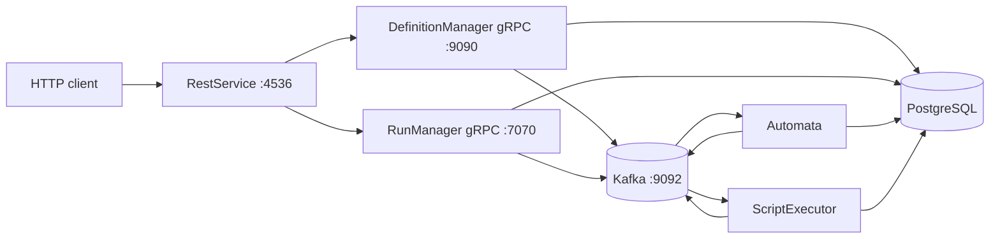

# Orka

Orka is a modular workflow orchestration backend. A workflow definition describes tasks, states, variables, conditions, input/output bindings, and optional containerized scripts. A workflow run is created from a definition and is advanced asynchronously through Kafka events.

The repository is a Maven multi-module project built with Java 24, Spring Boot 4.1.0, Spring gRPC, Apache Kafka, PostgreSQL, JPA/Hibernate, Protobuf, and Docker.

## Current status

This repository contains a working development-oriented service layout, but it is not yet production-ready. The REST facade, DefinitionManager, RunManager, Automata, and ScriptExecutor are present. AuthorizationManager is incomplete and is not currently a runnable Spring Boot service. See [Known limitations](#known-limitations) before deploying or relying on authorization and script execution behavior.

## Contents

- [Architecture](#architecture)
- [Repository layout](#repository-layout)
- [Requirements](#requirements)
- [Run with Docker Compose](#run-with-docker-compose)
- [Run services locally](#run-services-locally)
- [REST API](#rest-api)
- [gRPC API](#grpc-api)
- [Workflow model](#workflow-model)
- [Event-driven execution](#event-driven-execution)
- [Configuration](#configuration)
- [Persistence](#persistence)
- [Testing](#testing)
- [Development guidelines](#development-guidelines)
- [Known limitations](#known-limitations)
- [Troubleshooting](#troubleshooting)

## Architecture



### Service responsibilities

| Module | Responsibility | Interface or process | Default address |
| --- | --- | --- | --- |
| `common-grammar` | Shared JPA entities, repositories, utilities, Protobuf sources, and generated Java contracts | Library dependency | Not a service |
| `DefinitionManager` | Persists workflow definitions and serves DefinitionManager gRPC operations | Spring Boot and gRPC | `localhost:9090` |
| `RunManager` | Creates and queries workflow/task runs and serves RunManager gRPC operations | Spring Boot and gRPC | `localhost:7070` |
| `RestService` | Authenticated HTTP facade; calls DefinitionManager and RunManager | Spring Boot HTTP | `http://localhost:4536` |
| `Automata` | Consumes workflow events and advances the workflow state machine | Kafka consumer/producer | No HTTP port configured |
| `ScriptExecutor` | Consumes activated-state events and runs configured scripts in Docker containers | Kafka consumer/producer | No HTTP port is intended |
| `AuthorizationManager` | Intended authorization event consumer and authorization service | Incomplete; not currently runnable | None |

The root project is an aggregator with `pom` packaging. The root `src` directory is not a service module and should not be used as the application entry point.

## Repository layout

```text
.
├── pom.xml                    Maven reactor
├── docker-compose.yaml        Development infrastructure and service orchestration
├── common-grammar/            Shared domain model and .proto contracts
├── DefinitionManager/         Workflow-definition gRPC service
├── RunManager/                Workflow-run gRPC service
├── RestService/               HTTP API and JWT security
├── Automata/                  Workflow state-machine worker
├── ScriptExecutor/            Docker script-execution worker
├── AuthorizationManager/      Incomplete authorization worker
└── src/                       Root Spring starter skeleton, not a reactor module
```

Generated files under `target/` are build output. Edit Protobuf sources under `common-grammar/src/main/proto`, not generated Java files.

## Requirements

Install the following before using the project:

- JDK 24, with `java` and `javac` available on `PATH`.
- Docker Desktop with the Docker Compose plugin for the full stack.
- A Docker engine accessible to ScriptExecutor if containerized scripts are used.
- No separate Maven installation is required when using `mvnw.cmd`.

Verify the Java and Docker installations:

```powershell
java -version
docker --version
docker compose version
```

## Run with Docker Compose

Docker Compose starts PostgreSQL, Kafka, DefinitionManager, RunManager, RestService, Automata, and ScriptExecutor. Compose injects container-network addresses such as `postgres:5432`, `kafka:9092`, `dm:9090`, and `rm:7070`.

### 1. Build the JARs first

The service Dockerfiles copy module JARs from each module's `target` directory. Compose does not run Maven for those builds.

```powershell
.\mvnw.cmd clean package -DskipTests
```

### 2. Start the stack

```powershell
docker compose up --build
```

The public development endpoints are:

- REST API: `http://localhost:4536`
- DefinitionManager gRPC: `localhost:9090`
- RunManager gRPC: `localhost:7070`
- PostgreSQL: `localhost:5432`
- Kafka: `localhost:9092`

Run detached:

```powershell
docker compose up --build -d
```

View service logs:

```powershell
docker compose logs -f rest-service
docker compose logs -f automata script-executor
```

Stop the stack without deleting the database volume:

```powershell
docker compose down
```

Remove the persisted PostgreSQL data as well:

```powershell
docker compose down -v
```

The last command is destructive for local workflow definitions, runs, users, and related data.

## Run services locally

Start PostgreSQL and Kafka separately, or start only the infrastructure services from Compose:

```powershell
docker compose up -d postgres kafka
```

Build all modules:

```powershell
.\mvnw.cmd clean install
```

Start each Spring Boot application from the repository root in separate terminals:

```powershell
.\mvnw.cmd -pl DefinitionManager spring-boot:run
.\mvnw.cmd -pl RunManager spring-boot:run
.\mvnw.cmd -pl RestService spring-boot:run
.\mvnw.cmd -pl Automata spring-boot:run
.\mvnw.cmd -pl ScriptExecutor spring-boot:run
```

Start DefinitionManager and RunManager before RestService. Automata and ScriptExecutor require Kafka and PostgreSQL and should be started after the managers are available.

For local execution, the default addresses in the service YAML files are:

```text
PostgreSQL: jdbc:postgresql://localhost:5432/orka
Kafka:      localhost:9092
DefinitionManager gRPC: static://localhost:9090
RunManager gRPC:        static://localhost:7070
```

## REST API

The REST facade is available at `http://localhost:4536`. `/api/auth/**` is public. Every other route requires authentication through the `JWT` HTTP-only cookie issued by login or signup.

The API currently returns Protobuf-generated message types through Spring's JSON conversion. Use the field names shown in the request contracts and inspect the response body and status code rather than assuming every error uses the same envelope.

### Authentication

#### Sign up

`POST /api/auth/signup`

Request body:

```json
{
  "username": "alice",
  "email": "alice@example.com",
  "password": "change-this-password"
}
```

A successful response sets the `JWT` HTTP-only cookie. Duplicate usernames or email addresses return `409 Conflict`.

```powershell
curl.exe -i -c cookies.txt -X POST http://localhost:4536/api/auth/signup `
  -H "Content-Type: application/json" `
  -d '{"username":"alice","email":"alice@example.com","password":"change-this-password"}'
```

#### Log in

`POST /api/auth/login`

Send either `username` or `email`, together with `password`:

```json
{
  "username": "alice",
  "password": "change-this-password"
}
```

The login response also sets the `JWT` cookie. Preserve it for subsequent requests:

```powershell
curl.exe -i -c cookies.txt -b cookies.txt -X POST http://localhost:4536/api/auth/login `
  -H "Content-Type: application/json" `
  -d '{"username":"alice","password":"change-this-password"}'
```

### Workflow definitions

#### Create a workflow definition

`POST /create/workflowDefinition`

This route is intentionally documented with its current path. The controller annotation does not create an `/api/definition` prefix for the route below.

Request fields are defined in `common-grammar/src/main/proto/workflow_definition.proto` and include:

- `name`
- `description`
- `startTaskDefinitionName`
- `startStateDefinitionName`
- `taskDefinitions`
- `workflowVariables`
- `version`
- `creatorName`
- `authorizations`
- `failedCondition`
- `completedCondition`
- `runningCondition`

The authenticated username must match the username supplied by the request where the controller performs that check. A representative request shape is:

```json
{
  "name": "approval-workflow",
  "description": "Approval workflow",
  "startTaskDefinitionName": "approval-task",
  "startStateDefinitionName": "pending",
  "taskDefinitions": [],
  "workflowVariables": [],
  "version": 1,
  "creatorName": "alice",
  "authorizations": [],
  "failedCondition": {},
  "completedCondition": {},
  "runningCondition": {}
}
```

Do not treat the empty arrays and conditions above as a complete valid business workflow. The exact nested structure is specified by the task, state, variable, input/output, data-reference, and condition Protobuf files.

#### List workflow definitions

`POST /api/definition/workflowdefinitions`

The authenticated username is used by the controller when forwarding the request. The exact request and response types are defined by `definition_manager.proto` and `all_workflow_definitions.proto`.

### Workflow runs

All run routes require the `JWT` cookie.

| Method | Route | Purpose |
| --- | --- | --- |
| `POST` | `/api/run/startWorkflow` | Start a workflow run from a workflow-definition ID |
| `POST` | `/api/run/provideInput` | Provide a value for a task-run input path |
| `GET` | `/api/run/tasks` | List task runs visible to the authenticated user |
| `GET` | `/api/run/workflows` | List workflow runs visible to the authenticated user |
| `GET` | `/api/run/task/{id}` | Retrieve one task run |
| `GET` | `/api/run/workflow/{id}` | Retrieve one workflow run |

Start a workflow run with the fields from `StartWorkflowRunRequest`:

```json
{
  "id": "workflow-definition-id",
  "username": "alice",
  "taskRunAuthorization": [],
  "workflowAuthorization": []
}
```

Provide task input with the fields from `ProvideInputRequest`:

```json
{
  "username": "alice",
  "taskRunId": "task-run-id",
  "path": "$.approval",
  "inputVal": "approved"
}
```

Example authenticated request:

```powershell
curl.exe -b cookies.txt -X POST http://localhost:4536/api/run/provideInput `
  -H "Content-Type: application/json" `
  -d '{"username":"alice","taskRunId":"task-run-id","path":"$.approval","inputVal":"approved"}'
```

For complex Protobuf `google.protobuf.Value` values, use the JSON representation expected by the Protobuf converter and verify the endpoint response in the running service.

## gRPC API

The internal gRPC services are defined in `common-grammar/src/main/proto` and are used by RestService. They are not protected by the REST JWT filter; network access to ports `9090` and `7070` must therefore be restricted in any non-local deployment.

### DefinitionManager service

Defined in `definition_manager.proto`:

- `CreateWorkflowDefinition(CreateWorkflowDefinitionRequest)`
- `GetAllWorkflowDefinitions(GetAllWorkflowDefinitionsRequest)`

### RunManager service

Defined in `run_manager.proto`:

- `startWorkflowRun(StartWorkflowRunRequest)`
- `provideInput(ProvideInputRequest)`
- `getAllWorkflowRuns(GetAllWorkflowRunsRequest)`
- `getAllTaskRuns(GetAllTaskRunsRequest)`
- `getTaskRunById(GetSingleTaskRunRequest)`
- `getWorkflowRunById(GetSingleWorkflowRunRequest)`

The Maven build generates Java Protobuf classes and gRPC stubs during the `common-grammar` build. Do not add generated output to source control.

## Workflow model

A workflow definition is composed of:

- Tasks and states.
- A named start task and start state.
- Workflow variables with a declared type and default Protobuf value.
- State input and output schemas and bindings.
- Data references to constants, state input/output, or workflow variables.
- Conditions over state, input, output, and workflow variables.
- Optional script definitions containing a Docker image, version, entry command, timeout, and environment variables.
- Workflow and task authorization declarations.

The canonical schema is the set of files in `common-grammar/src/main/proto`, especially:

- `workflow_definition.proto`
- `task_definition.proto`
- `state_definition.proto`
- `script_definition.proto`
- `variable.proto`
- `input_output.proto`
- `data_reference.proto`
- `condition.proto`
- `common.proto`

Use these contracts as the source of truth for field names, enum values, nesting, and wire compatibility.

## Event-driven execution

Kafka topics are declared in `common-grammar/src/main/java/com/Orka/events/KafkaTopics.java`:

| Topic | Producer | Consumer or purpose |
| --- | --- | --- |
| `workflow-definition-created` | DefinitionManager | AuthorizationManager consumer |
| `workflow-created` | RunManager | Automata starts workflow advancement |
| `state-activated` | Automata | ScriptExecutor starts script execution |
| `script-completed` | ScriptExecutor | Automata advances after script completion |
| `task-input-provided` | RunManager | Automata advances after external input |
| `workflow-definition-created` | DefinitionManager | Definition-created notification |

The normal intended flow is:

1. RestService authenticates the user and asks DefinitionManager to create a definition.
2. DefinitionManager persists the definition and publishes `workflow-definition-created`.
3. RestService asks RunManager to start a run.
4. RunManager persists the run and publishes `workflow-created`.
5. Automata consumes the workflow event, advances the state machine, and publishes `state-activated`.
6. ScriptExecutor consumes the activated state, runs the configured script, and publishes `script-completed`.
7. Automata consumes completion or input events and continues the run.

Kafka is configured as a single plaintext broker with replication factor `1` in Compose. This is appropriate for local development only.

## Configuration

Service configuration is stored in each module's `src/main/resources/application.yml`.

| Variable | Default | Used by | Meaning |
| --- | --- | --- | --- |
| `PG_ADDRESS` | `jdbc:postgresql://localhost:5432/orka` | All JPA services | PostgreSQL JDBC URL |
| `KAFKA_ADDRESS` | `localhost:9092` | Kafka services | Kafka bootstrap server |
| `DM_ADDRESS` | `static://localhost:9090` | RestService and workers where configured | DefinitionManager gRPC channel |
| `RM_ADDRESS` | `static://localhost:7070` | RestService and workers where configured | RunManager gRPC channel |

Configured service ports:

| Service | Configuration |
| --- | --- |
| RestService | `server.port: 4536` |
| DefinitionManager | `spring.grpc.server.port: 9090` |
| RunManager | `spring.grpc.server.port: 7070` |
| Automata | No HTTP or gRPC server port configured |
| ScriptExecutor | No HTTP port is intended; its current YAML contains a gRPC port setting that is not part of its worker role |

### Database settings

The default database is PostgreSQL database `orka`, user `postgres`, at port `5432`. Hibernate is configured with `ddl-auto: update`; there are no Flyway or Liquibase migrations in the repository. All JPA services use the shared schema.

The current repository contains development credentials directly in YAML and Compose. Replace them with environment-provided secrets before sharing a deployment or exposing the services outside a trusted local network.

### CORS and cookies

RestService currently allows the origin `http://localhost:8080`, all methods and headers, and credentials. The JWT cookie is named `JWT`, is HTTP-only, uses `SameSite=Lax`, applies to `/`, and has a one-hour cookie lifetime. The JWT utility currently has a different token expiration configuration; align these values before production use.

## Persistence

`common-grammar` owns the shared entity and repository model. Persisted domains include:

- Users and BCrypt password hashes.
- Workflow definitions, task definitions, state definitions, scripts, variables, conditions, and data references.
- Workflow runs, task runs, state runs, and script executions.
- Workflow-definition, task-definition, workflow-run, and task-run authorization records.

Because the services share one database and Hibernate updates the schema at startup, run only compatible application versions against a database. For repeatable deployments, introduce versioned migrations before changing the schema in production.

## Testing

Run the full reactor test suite:

```powershell
.\mvnw.cmd test
```

Run tests for one module and its required dependencies:

```powershell
.\mvnw.cmd -pl DefinitionManager -am test
.\mvnw.cmd -pl AuthorizationManager -am test
.\mvnw.cmd -pl RestService -am test
```

Build and install all modules:

```powershell
.\mvnw.cmd clean install
```

Existing standard test sources are concentrated in the root, DefinitionManager, and AuthorizationManager. Automata, RunManager, RestService, and ScriptExecutor currently have limited or no standard JUnit coverage. The executable examples under `common-grammar/src/main/java/com/Orka/apiTests` are not standard test-source classes and should not be treated as a reliable automated test suite.

Before a change is merged, run the narrowest relevant tests first, then the full reactor build when shared Protobuf, entity, or event contracts change.

## Development guidelines

### Contract-first changes

1. Change the relevant `.proto` file when changing a public gRPC or REST message.
2. Build `common-grammar` to regenerate Java contracts.
3. Update both the server implementation and every client using the contract.
4. Add or update tests for field compatibility, validation, status codes, and error responses.
5. Document the endpoint or event change in this README.

Do not edit generated sources under `target/generated-sources` or `target/classes`.

### Service boundaries

- Keep HTTP concerns in RestService.
- Keep workflow-definition persistence and definition gRPC operations in DefinitionManager.
- Keep run persistence and run gRPC operations in RunManager.
- Keep state-machine transitions in Automata.
- Keep process/container execution in ScriptExecutor.
- Put shared entities, repositories, Protobuf contracts, and genuinely shared utilities in common-grammar.
- Do not make workers depend on REST controller behavior.

### Events

- Treat topic names and event payloads as versioned contracts.
- Use one agreed Protobuf message per topic and keep producer and consumer payload types aligned.
- Define retry, ordering, duplicate delivery, and failure behavior for every consumer.
- Verify serialization and deserialization with an integration test when adding or changing a topic.
- Do not rely on Kafka auto-creation for production topic management.

### Authorization

- Enforce authorization in the service that owns the protected resource, not only in the REST facade.
- Derive the acting username from the authenticated principal where possible; do not trust a request-body username alone.
- Add tests for owner, authorized user, unauthorized user, missing resource, and cross-user access.
- Do not expose the internal gRPC ports directly to untrusted clients.

### Scripts and containers

- Treat image names, commands, environment variables, and output as untrusted input.
- Apply resource limits, network restrictions, filesystem restrictions, non-root execution, and an explicit allow-list of images and commands before production use.
- Do not allow the worker to access a host Docker socket without understanding the resulting host-level security risk.
- Persist and correlate exit code, stdout, stderr, timeout, state-run ID, and failure status.
- Make the configured script timeout authoritative instead of silently using a hard-coded value.

### Database and configuration

- Never commit real passwords, JWT signing keys, or broker credentials.
- Replace `ddl-auto: update` with reviewed, versioned migrations for deployed environments.
- Keep local defaults convenient but make production configuration explicit and fail closed when required secrets are absent.
- Use health checks and readiness checks for PostgreSQL, Kafka, DefinitionManager, and RunManager before sending traffic to RestService.

## Known limitations

The following behavior is visible in the current source and should be treated as work remaining, not as a guarantee of the platform:

- AuthorizationManager has an empty application main and no `@SpringBootApplication`. Its Kafka handler parses the workflow-definition event but does not currently invoke the authorization addition service.
- `AuthAnsweringService` is not annotated as a Spring bean while RunManager constructor-injects it(it uses a local modular auth provisioning service which will be swapped out as soon as the AuthAnsweringService service will be live ).
- Several authorization methods return `null`; input authorization is disabled in `TaskRunService` ( this was done for testing purposes will be brought back live as soon as possible).
- ScriptExecutor depends on Docker access and expects the executed container to write `/orka/output.json` (it is the contract).
- Script execution uses a hard-coded 500-second timeout rather than consistently honoring the Protobuf timeout field.
- Failed or timed-out script execution does not consistently persist a completed failure record with a state-run ID.
- PostgreSQL credentials and the JWT signing secret are hard-coded in the current implementation.
- The JWT token lifetime and JWT cookie lifetime are inconsistent.
- All JPA services update the same schema concurrently.
- Dockerfiles expose `8080`(not a bug but a design smell -> will be patched in the next release), while configured service ports are `4536`, `9090`, and `7070`. Compose maps the configured ports, but the Dockerfile metadata should be aligned.
- Compose uses floating image tags such as `postgres` and `apache/kafka:latest`; pin versions for reproducible builds.(had to add the latest flag because of the issue with kafka-raft)
- Kafka is a single-node plaintext development broker with replication factor `1`(will be scaled up soon -> number only for local develpement).
- There is no complete API specification or production deployment profile checked in.

## Troubleshooting

### Compose cannot build a service image

Run the Maven package step first. The Dockerfiles copy prebuilt JARs from `target` and Compose does not compile the Java modules.

```powershell
.\mvnw.cmd clean package -DskipTests
docker compose build --no-cache
```

### RestService cannot connect to a manager

- When running locally, use `static://localhost:9090` and `static://localhost:7070`.
- When running in Compose, use `static://dm:9090` and `static://rm:7070`.
- Check `docker compose logs dm rm rest-service`.
- Confirm that DefinitionManager and RunManager have started successfully and can reach PostgreSQL.

### Services cannot connect to PostgreSQL or Kafka

- Local processes must use `localhost` addresses.
- Containers must use service names such as `postgres` and `kafka`, not `localhost`.
- Check health status with `docker compose ps`.
- Inspect the effective `PG_ADDRESS` and `KAFKA_ADDRESS` environment variables.

### Authenticated requests return `401`

- Call signup or login first.
- Preserve the `JWT` cookie with `curl.exe -c cookies.txt` and send it with `curl.exe -b cookies.txt`.
- Confirm that the request is sent to RestService on port `4536`.
- For username-checked requests, ensure the request username matches the authenticated user.

### A workflow does not progress

Inspect the logs for RunManager, Automata, and ScriptExecutor together. Confirm that Kafka topics exist, that producer and consumer payload types match, that the worker can access PostgreSQL, and that a script writes `/orka/output.json` when output is required.

## License and contribution information

No license or contribution policy is defined in the repository. Add those policies separately when the project owners decide on them.
